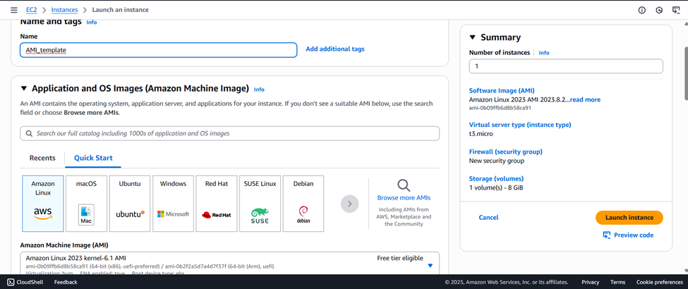
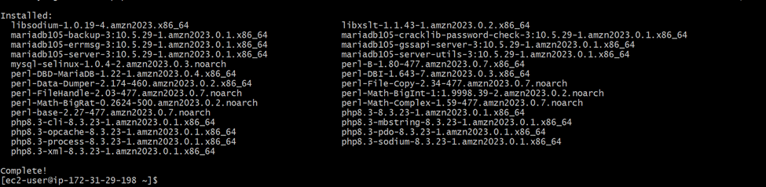
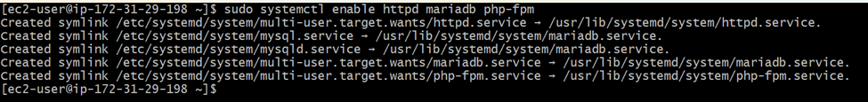
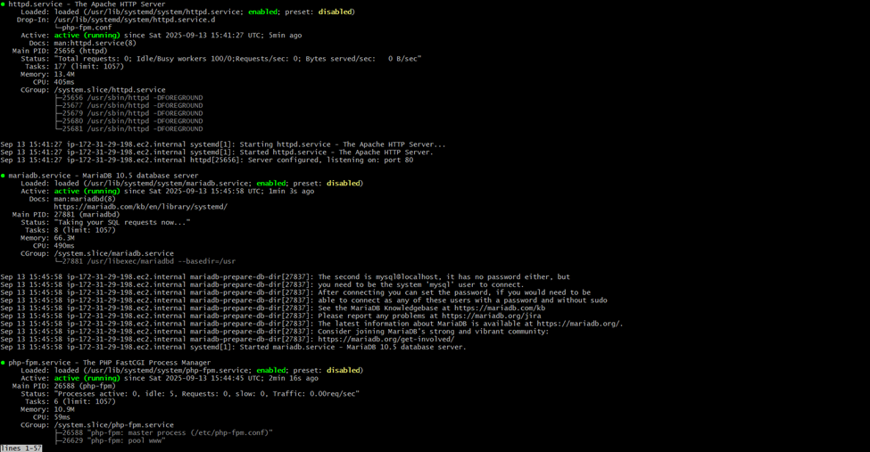
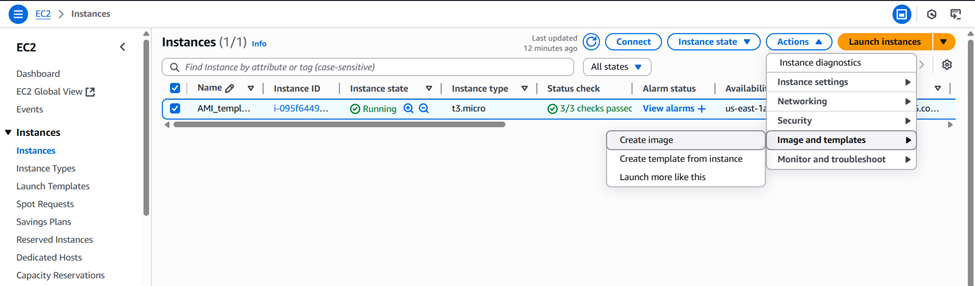
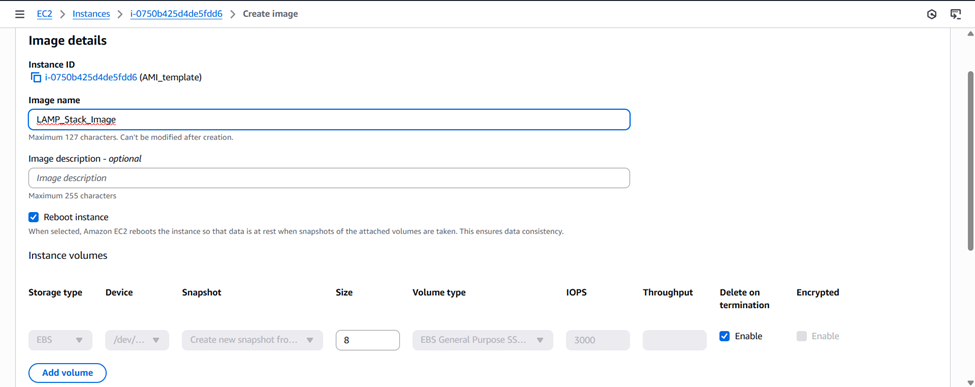
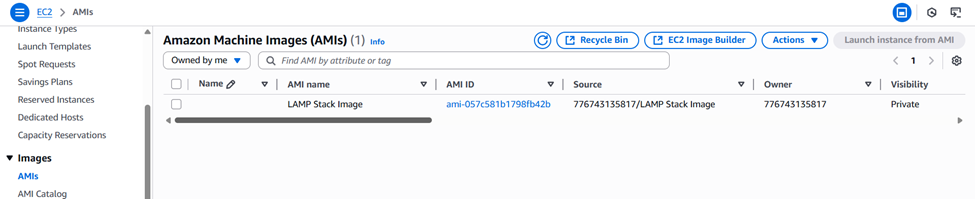
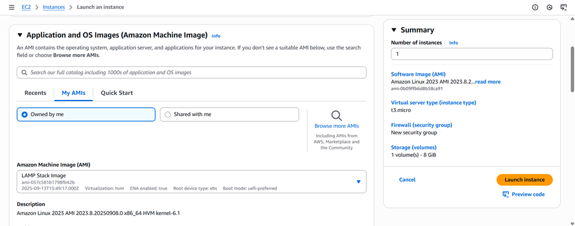
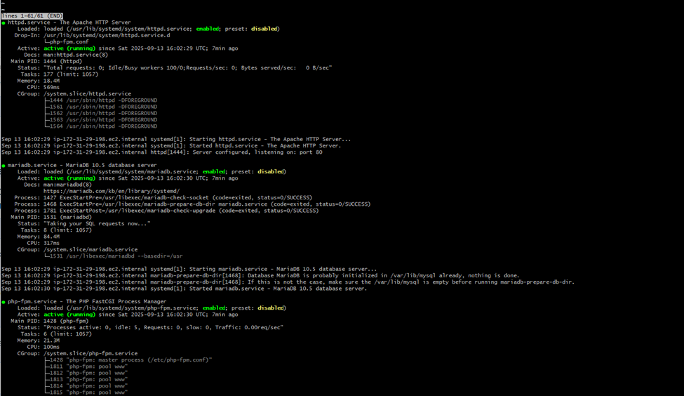
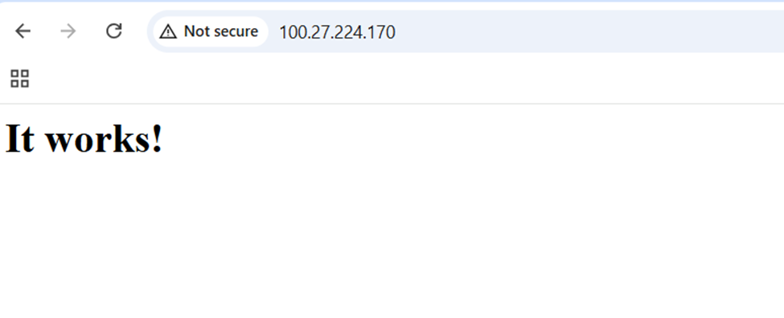

# Creating a Custom AMI on AWS  
*“From Launching EC2 to Creating a Custom Amazon Machine Image (AMI) and Using It for Faster Deployments”*

---

## Overview  
This project demonstrates how to create a **custom Amazon Machine Image (AMI)** from an **Amazon Linux 2023 EC2 instance** with a pre-installed **LAMP stack**. This allows faster, consistent deployments of new servers with the same configuration.

---

## Prerequisites  

Before starting, make sure you have:  
- **AWS Account** with access to EC2  
- **Amazon Linux 2023 AMI** available in your region  
- **Security Group** configured with required ports:  
  - **22 (SSH)** to connect to the instance  
  - **80 (HTTP)** to access web server  

---

## Steps Followed  

### 1. Launch EC2 Instance  

- Go to the **AWS Management Console → EC2 → Launch Instance**  
- Choose **Amazon Linux 2023 Kernel**  
- Select instance type (e.g. t2.micro)  
- Configure key pair and security group  

    

---

### 2. Connect to EC2 Instance  

Use either **SSH** or **EC2 Instance Connect** to log in:  

```bash
ssh -i <your-key.pem> ec2-user@<public-ip>
````

---

### 3. Install LAMP Stack

On the EC2 instance:

```bash
sudo yum update -y
sudo yum install httpd mariadb105-server php -y
```



---

### 4. Start and Enable Services

Enable services so they automatically start after reboot:

```bash
sudo systemctl start httpd mariadb php-fpm
sudo systemctl enable httpd mariadb php-fpm
```



---

### 5. Check Services Status

```bash
sudo systemctl status httpd mariadb php-fpm
```



---

### 6. Create AMI from Instance

* Go to **AWS Management Console → EC2 → Instances**
* Select the instance → Click **Actions → Images and Templates → Create Image**

    

* Enter **Image Name**, keep defaults, and click **Create Image**


    

---

### 7. View AMI

* Go to **AWS Management Console → EC2 → AMIs**
* You’ll see your newly created AMI listed

    

---

### 8. Launch New Instance Using AMI

* Go to **Launch Instance**
* Under **Application and OS Images**, choose **My AMIs**
* Select the AMI you created and launch the instance
     
---

### 9. Verify Services on New Instance

Connect to the new instance:

```bash
ssh -i <your-key.pem> ec2-user@<public-ip-of-new-instance>
sudo systemctl status httpd mariadb php-fpm
```


Check if the services installed in the original instance are running automatically in our recent instance.
Try to access the instance using its **public IP** in your browser.



---

## Result

We successfully created a **custom AMI** with LAMP stack pre-installed and launched a new EC2 instance using that AMI. All services started automatically, demonstrating a faster and consistent deployment process.

---

## Tech Stack

* **OS**: Amazon Linux 2023
* **Web Server**: Apache (httpd)
* **Database**: MariaDB
* **Language**: PHP
* **Hosting**: AWS EC2

---

## Summary

By creating a **custom AMI**, you can save time on setting up new EC2 instances with pre-installed software. This ensures consistency, scalability, and faster deployments across environments.


